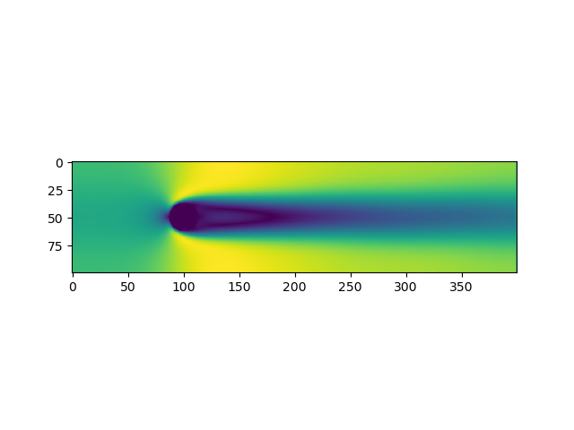
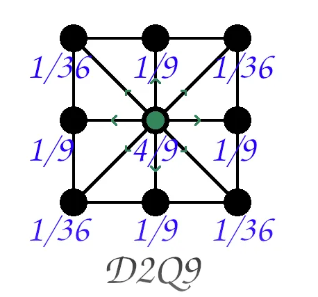

# fluid_simulation
Lattice Boltzmann fluid simulation

## Create Your Own Lattice Boltzmann Simulation (With Python)

### Philip Mocz (2020) Princeton Univeristy, [@PMocz](https://twitter.com/PMocz)

Simulate a flow past cylinder with the Lattice Boltzmann method

```
python lbm_simulation.py
```



# Brief explonation of Lattice Boltzmann

Discrete Velocity Model: LBM models fluid dynamics on a grid where fluid particles move in discrete directions and collide based on local rules.

Macroscopic Quantities: Key quantities like density and velocity are derived from the distribution functions, which describe the probability of particles moving in each direction.

Collision and Streaming: Fluid particles collide (relax toward equilibrium) and then stream to neighboring cells based on their velocity.

Boundary Conditions: Solid boundaries (like the cylinder) are handled using bounce-back rules, where particles reverse their direction upon collision with the obstacle.

Low Mach Number Flows: LBM is particularly well-suited for simulating incompressible or nearly incompressible fluid flows.

## 9-Lattice Mapping (D2Q9)
The simulation uses a 9-lattice velocity model (D2Q9). This model defines nine possible directions for particle movement at each grid point, as shown below:



# Calculations:
density - use density.png from folder

momentum - use momentum.png from folder

equilivrium - use equilibrium.png from foldrer

collide - use collide.png from folder

